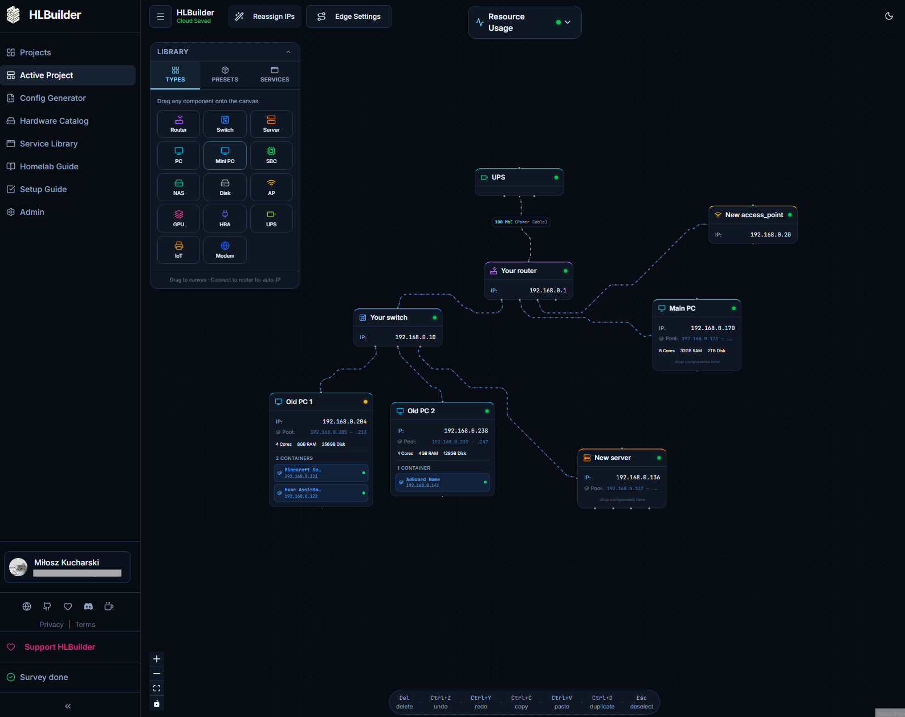

# HLBuilder


[](https://www.gnu.org/licenses/agpl-3.0)

HLBuilder is a comprehensive, interactive web application designed to simplify the process of planning and architecting home laboratory infrastructure. It provides users with a visual interface to design network topologies, receive intelligent hardware recommendations based on their self-hosting needs, and generate actionable shopping lists.

## 🚀 Key Features

### 1. Visual Network Builder
The core of the application is a visual canvas powered by **ReactFlow**.
- **Drag-and-drop hardware nodes**: Routers, switches, servers, NAS, Mini-PCs, SBCs (like Raspberry Pi), UPS, and more.
- **Wire components**: Graph-based representation of physical and logical connections.
- **Nested Virtualization**: Define Virtual Machines (VMs), Containers, or LXCs directly on compute nodes.
- **Real-time Synchronization**: The visual state is continuously synchronized with a PostgreSQL database.

### 2. Automated IP Management (`hlbIPAM`)
A sophisticated backend microservice manages network addressing:
- **Microservice Architecture for Scaling**: Built as a completely independent, stateless Go service. IP allocation requires heavy graph traversal and subnet math; isolating it means we can horizontally scale the IPAM workers seamlessly under high load without dragging down the main API server.
- **Topology-Aware BFS**: Automatically assigns IP addresses by performing a Breadth-First Search from the gateway.
- **Dynamic Pool Sizing**: Intelligently packs VM-hosting devices into separate pools without collisions.
- **Conflict Prevention**: Handles custom IP assignments and avoids DHCP range overlaps.

### 3. Service Catalog & Hardware Recommendations
- **Comprehensive Catalog**: Browse popular homelab services with pre-defined resource requirements.
- **3-Tier Suggestions**: Generates "Minimal", "Recommended", and "Optimal" hardware profiles.
- **Live Resource Dashboard**: Calculates aggregate CPU, RAM, Storage, and Power needs to ensure hardware can handle the concurrent load.

### 4. Actionable Shopping List
- **Itemized Components**: Automatically generates a shopping list including main hardware and necessary peripherals (RAM, NVMe, etc.).
- **Price Estimation**: Provides estimated costs with direct purchase links based on your region.

---

## 🛠️ Tech Stack

| Layer | Technology |
|-------|-----------|
| **Frontend** | React 18 + TypeScript, Vite, ReactFlow, TailwindCSS, Zustand |
| **Backend API** | Go 1.24+, Gin, GORM v1.25.x |
| **IPAM Microservice**| Go 1.24+, Standard Library REST API |
| **Database** | PostgreSQL 15 |
| **Auth & Security** | Google OAuth 2.0 + JWT |
| **Deploy** | Docker & Docker Compose |

---

## 🏗️ Architecture Overview
For detailed information on the codebase architecture, folder structure, testing infrastructure, and known pitfalls, please refer to [docs/ARCHITECTURE.md](./docs/ARCHITECTURE.md). 
For the feature roadmap and future ideas, see [ROADMAP.md](./ROADMAP.md).

---

## 🏠 Self-Hosting Without Google OAuth (Auth-Disabled Mode)

HLBuilder ships with a built-in **auth-disabled mode** designed for self-hosted / local deployments where you don't want to (or can't) set up Google OAuth credentials. When enabled, the application bypasses all login screens and automatically provisions a local admin user — no Google account, no OAuth app registration, and no tokens required.

### How It Works

The entire mechanism is driven by a single condition: **whether `GOOGLE_CLIENT_ID` is set**.

| Component | What happens when `GOOGLE_CLIENT_ID` is **empty / unset** |
|---|---|
| **Backend** | `config.AuthDisabled` becomes `true`. Every protected endpoint's auth middleware skips JWT validation and instead auto-provisions a **Local Admin** user (`local@homelab.local`) with full access, including admin privileges. |
| **Frontend** | `VITE_GOOGLE_CLIENT_ID` is empty, so the Google login button is non-functional. The auth hook detects this and calls `/auth/me` without a token — the backend responds with the Local Admin user, automatically logging you in. |
| **Login Page** | You will still briefly see the login page on first load, but the auto-login fires immediately and redirects you to the projects dashboard. |

### Quick Start (Auth-Disabled)

Simply start the stack **without** providing any Google or JWT variables:

```bash
git clone https://github.com/Butterski/homelab-builder.git
cd homelab-builder

# No .env file needed — just start the containers
docker compose up -d
```

That's it. Open `http://localhost:3000` and you'll be automatically logged in as **Local Admin**.

The default `docker-compose.yml` references `${GOOGLE_CLIENT_ID}`, `${VITE_GOOGLE_CLIENT_ID}`, and `${JWT_SECRET}` from the environment / `.env` file. When these variables are absent, Docker Compose passes empty strings, which triggers auth-disabled mode on both the backend and frontend.

### Verifying Auth-Disabled Mode

You can confirm the mode is active by checking the backend logs on startup:

```
Starting HLBuilder Backend...
Database connected. Setting up routes...
```

There will be **no** panic or error about `JWT_SECRET` because the backend only enforces a strong JWT secret in production mode (`GIN_MODE=release`). In the default Docker Compose config, `GIN_MODE` is set to `release`, so you must either:

1. **Remove or change** `GIN_MODE` from the `backend` service environment (recommended for local self-hosting), or
2. **Set `JWT_SECRET`** to any random string (e.g., `JWT_SECRET=my-local-secret-12345`).

#### Recommended `docker-compose.override.yml` for Self-Hosting

Create a `docker-compose.override.yml` next to the main compose file:

```yaml
services:
  backend:
    environment:
      GIN_MODE: "debug"      # Disables the JWT_SECRET strength check
      # GOOGLE_CLIENT_ID intentionally left unset → auth disabled
      # JWT_SECRET intentionally left unset → uses built-in dev secret
```

Then run:

```bash
docker compose up -d
```

### Environment Variables Reference (Auth-Related)

| Variable | Where | Required for Auth-Disabled? | Description |
|---|---|---|---|
| `GOOGLE_CLIENT_ID` | Backend | **No — leave unset** | When empty, backend sets `AuthDisabled=true` and skips JWT validation on all protected routes. |
| `VITE_GOOGLE_CLIENT_ID` | Frontend (build arg) | **No — leave unset** | When empty, the frontend skips the Google login flow and auto-authenticates via `/auth/me`. |
| `JWT_SECRET` | Backend | **No** (unless `GIN_MODE=release`) | Secret for signing JWTs. In auth-disabled mode JWTs are never issued, so this is unused. If running in release mode, set it to any random string. |
| `GIN_MODE` | Backend | **No** | Set to `debug` (or omit) to skip the JWT_SECRET strength check. Set to `release` for production with Google OAuth. |

### The Local Admin User

When auth is disabled, the backend automatically creates (or reuses) a user with these properties:

| Field | Value |
|---|---|
| Email | `local@homelab.local` |
| Name | `Local Admin` |
| Google ID | `local-auth-disabled` |
| Avatar | DiceBear generated avatar |

This user is created on first request to any protected endpoint and persists in the database. All builds, selections, and preferences are stored under this single user. If you later enable Google OAuth, this user remains in the database but will no longer be auto-selected — you'll log in with your Google account instead.

### Dev Login Endpoint (Advanced)

In addition to auth-disabled mode, when the backend is **not** running in release mode (`GIN_MODE != release`), a development login endpoint is available:

```
POST /auth/dev
Content-Type: application/json

{ "email": "any-email@example.com" }
```

This creates (or logs into) a user with the given email — no Google account needed. It returns a JWT token you can use in `Authorization: Bearer <token>` headers. This is useful for:
- Testing multi-user scenarios locally
- Scripting / API access without a browser
- Frontend development with `api.devLogin("your@email.com")`

> **Note:** The `/auth/dev` endpoint is **disabled** when `GIN_MODE=release` to prevent unauthorized access in production.

### Security Considerations

- **Auth-disabled mode is intended for local / trusted network deployments only.** Anyone who can reach your HLBuilder instance will have full admin access without any credentials.
- **Do not expose an auth-disabled instance to the public internet.** If you need external access, set up Google OAuth or put the instance behind a VPN / reverse proxy with its own authentication.
- **The dev login endpoint (`/auth/dev`) is also only available in non-release mode.** It will not be exposed in production deployments.

---

## 🚀 Quick Start

```bash
# Clone the repository
git clone https://github.com/Butterski/homelab-builder.git
cd homelab-builder

# Start all services via Docker Compose
docker compose up -d

# Access the application
# Frontend: http://localhost:3000
# Backend:  http://localhost:8080
```

## 👨‍💻 Local Development

```bash
# Backend (requires Go 1.24+)
cd backend
cp ../.env.example ../.env
go run ./cmd/server

# Frontend (requires Node 20+)
cd frontend
npm install
npm run dev
```

## 🎨 Credits
HLBuilder's custom 3-layer structural logo was designed and created by **[Paweł Kręczewski](https://www.linkedin.com/in/pawe%C5%82-kr%C4%99czewski-a2a372242/)**.

## 📄 License
This project is licensed under the **GNU Affero General Public License v3.0 (AGPL-3.0)**. See the [LICENSE](./LICENSE) file for details.
