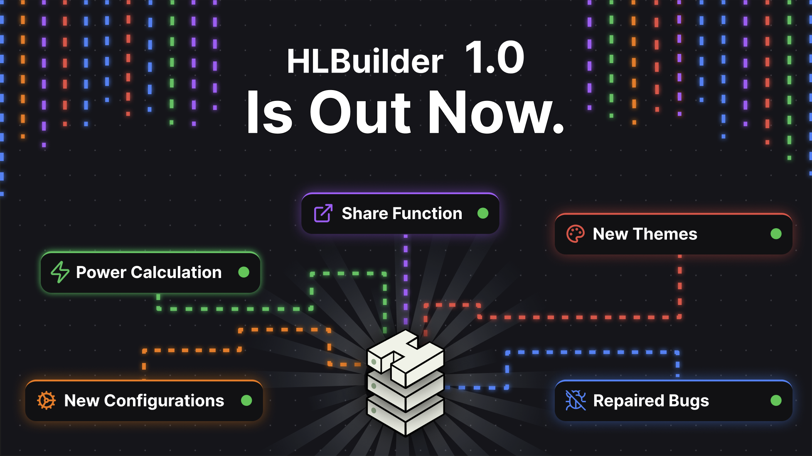
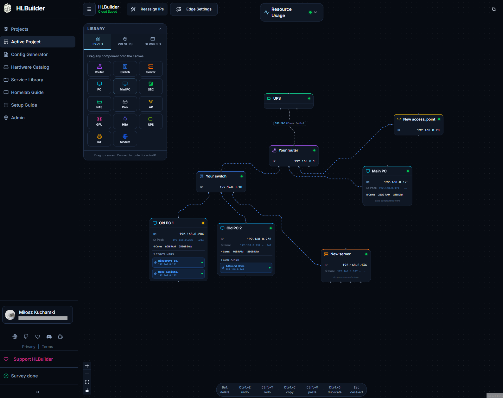

# HLBuilder


[](https://www.gnu.org/licenses/agpl-3.0)





HLBuilder is a comprehensive, interactive web application designed to simplify the process of planning and architecting home laboratory infrastructure. It provides users with a visual interface to design network topologies, get addresses assigned and hardware sized for the services they want to run, and generate the configuration files to build it.

## 🚀 Key Features

### 1. Visual Network Builder
The core of the application is a visual canvas powered by **ReactFlow**.
- **Drag-and-drop hardware nodes**: Routers, switches, servers, NAS, Mini-PCs, SBCs (like Raspberry Pi), UPS, game consoles, and more.
- **Wire components**: Graph-based representation of physical and logical connections.
- **Nested Virtualization**: Define Virtual Machines (VMs), Containers, or LXCs directly on compute nodes, and wire them in a host's virtual network. See [docs/VIRTUAL-NETWORKS.md](./docs/VIRTUAL-NETWORKS.md).
- **Polish**: One click arranges the canvas with a layout engine written for it: internet at the top, every device under the port it is plugged into, a rack moved as one block, no overlapping cards, and the cables of the network tree drawn without a crossing. Two styles (Hierarchy and Compact), shown on your own build before anything moves; one `Ctrl+Z` undoes it.
- **Saves by itself, stays current**: The canvas is saved to PostgreSQL as you work and says honestly whether it is saved. A failed save is retried, changes made in another tab arrive without a reload, and an edit that lost against a newer version is one Undo away.

### 2. Automated IP Management (`hlbIPAM`)
A sophisticated backend microservice manages network addressing:
- **Microservice Architecture for Scaling**: Built as a completely independent, stateless Go service. IP allocation requires heavy graph traversal and subnet math; isolating it means we can horizontally scale the IPAM workers seamlessly under high load without dragging down the main API server.
- **Topology-Aware BFS**: Automatically assigns IP addresses by performing a Breadth-First Search from the gateway.
- **Dynamic Pool Sizing**: Intelligently packs VM-hosting devices into separate pools without collisions.
- **Conflict Prevention**: Handles custom IP assignments and avoids DHCP range overlaps.

### 3. Service Catalog & Hardware Recommendations
- **Comprehensive Catalog**: Browse popular homelab services with pre-defined resource requirements.
- **3-Tier Suggestions**: Generates "Minimal", "Recommended", and "Optimal" hardware profiles.
- **Live Resource Dashboard**: Calculates aggregate CPU, RAM, Storage, and Power needs to ensure hardware can handle the concurrent load.

### 4. Design With an LLM
- **MCP server**: Connect Claude Code, Cursor, VS Code or any MCP client to `/mcp` with a personal access token. The client can read your builds, search the catalogs and propose changes. See [docs/MCP.md](./docs/MCP.md).
- **In-app assistant**: An optional chat panel in the builder, off by default. You bring your own provider and API key (Anthropic, OpenAI, Gemini, OpenRouter, Ollama or any OpenAI-compatible endpoint). It shows each step it takes while it works: what it reads, what it searches for and what came of it.
- **You approve every change**: An LLM never edits a build. It sends a proposal that you review on the canvas itself, drawn as the build would be with every change marked, and then apply or reject; one `Ctrl+Z` undoes an applied proposal.
- **Keys you can verify**: Provider keys are stored AES-256-GCM encrypted and never sent back to the browser. The settings page shows the stored record and links to the code. See [docs/AI-ASSISTANT-SECURITY.md](./docs/AI-ASSISTANT-SECURITY.md).

### 5. Plan a LAN Party or a Game Server
A project can be a homelab, a **LAN party** or a **game server** for friends. See [docs/GAMING.md](./docs/GAMING.md).
- **Guided planner**: Answer a few questions (players, games, your internet line, the venue's power) and get a wired, addressed build to refine.
- **LAN tables and consoles**: A table stands for its seats and its switch, so a 64-seat party stays readable. Seats take DHCP leases and the router's pool grows to fit them. PCs and consoles can join an access point over Wi-Fi.
- **Game servers sized per player**: Minecraft, Valheim, Palworld, CS2, Factorio and more, plus LANCache, Mumble and server panels. Each server knows its ports and how friends reach it: LAN only, port forward, VPN or relay.
- **Game plan report**: Which ports to forward on which router, whether your upload is enough, carrier-grade NAT, port clashes, free switch ports, the DHCP pool, and the load on every power circuit against its breaker.
- **Ready-to-use files**: A compose file per game host, the port-forward list, a connect sheet for your players and a party plan.

### 6. Plan With the Hardware You Own
An inventory of what is on your shelf, and a look at what really runs on it. See [docs/INVENTORY.md](./docs/INVENTORY.md).
- **Inventory**: List your machines, switches, memory, disks and cables once, with where each is kept. It belongs to your account and sits beside the canvas in every project.
- **Your machines on the canvas**: Drag an owned device in and it is that machine: its role in the project has one name, the machine another. Spare memory in the drawer is offered to a host that is short of it.
- **Proxmox import**: Connect Proxmox VE with a read-only API token (or paste an export) and see which machine of your inventory each host is.
- **Plan against reality**: Lay a project beside the cluster: guests on both sides, guests only on Proxmox, guests only in the plan, and each host's capacity as planned and as it runs. You tick what to take over, review it on the canvas and apply it. Nothing is imported by itself.

---

## 🛠️ Tech Stack

| Layer | Technology |
|-------|-----------|
| **Frontend** | React 19 + TypeScript, Vite, ReactFlow, TailwindCSS, Zustand |
| **Backend API** | Go 1.25+, Gin, GORM |
| **LLM access** | MCP (streamable HTTP, official Go SDK), Anthropic and OpenAI-compatible providers |
| **IPAM Microservice**| Go 1.24+, Standard Library REST API |
| **Database** | PostgreSQL 17 |
| **Auth & Security** | Google OAuth 2.0 + JWT |
| **Deploy** | Docker & Docker Compose |

---

## 🏗️ Architecture Overview
For detailed information on the codebase architecture, folder structure, testing infrastructure, and known pitfalls, please refer to [AGENTS.md](./AGENTS.md).

---

## 🏠 Self-Hosting Without Google OAuth (Auth-Disabled Mode)

HLBuilder ships with a built-in **auth-disabled mode** designed for self-hosted / local deployments where you don't want to (or can't) set up Google OAuth credentials. When enabled, the application bypasses all login screens and automatically provisions a local admin user - no Google account, no OAuth app registration, and no tokens required.

### How It Works

The entire mechanism is driven by a single condition: **whether `GOOGLE_CLIENT_ID` is set**.

| Component | What happens when `GOOGLE_CLIENT_ID` is **empty / unset** |
|---|---|
| **Backend** | `config.AuthDisabled` becomes `true`. Every protected endpoint's auth middleware skips JWT validation and instead auto-provisions a **Local Admin** user (`local@homelab.local`) with full access, including admin privileges. |
| **Frontend** | The app reads `/auth/config` from the backend, sees that login is off and calls `/auth/me` without a token: the backend answers with the Local Admin user. |
| **Login Page** | There is none: you land on the projects page at once. |

### Quick Start (Auth-Disabled)

Build the stack from this checkout and leave Google/JWT variables empty:

```bash
git clone https://github.com/Butterski/homelab-builder.git
cd homelab-builder

cp .env.hosted.example .env
docker compose up -d --build
```

That's it. Open `http://localhost:3000` and you'll be automatically logged in as **Local Admin**.

The root `docker-compose.yml` builds the frontend, backend, and hlbIPAM images from the repository and starts them with PostgreSQL. The frontend proxies API traffic internally to the backend.

Important: keep `DB_HOST=postgres` when using the included stack. Docker Compose provides that hostname on its private network and waits for PostgreSQL and hlbIPAM health checks before starting the backend and frontend.

### Proxmox LXC / Docker Local Workspace

Use this if you want HLBuilder running as a private local workspace on a Proxmox Docker LXC. The same root Compose command builds and runs the complete stack.

Use a Debian or Ubuntu LXC with Docker installed. A small instance is enough for testing, for example 2 CPU cores, 2 GB RAM, and 8 GB disk. For longer-term use, give the LXC more disk because Postgres data is stored in the `postgres_data` Docker volume.

Inside the LXC:

```bash
git clone https://github.com/Butterski/homelab-builder.git
cd homelab-builder
cp .env.hosted.example .env
nano .env

docker compose up -d --build
```

For local workspace mode, keep Google empty:

```env
GIN_MODE=debug
GOOGLE_CLIENT_ID=
JWT_SECRET=
```

Set `DB_PASSWORD` to something private if this LXC is not disposable. Leave `DB_HOST=postgres`; that name is created by Docker Compose.

Expected containers:

```text
homelab-builder-db
homelab-builder-ipam
homelab-builder-backend
homelab-builder-app
```

For local access, open `http://LXC_IP:3000` from your browser. The app will use the built-in Local Admin workspace account.

### Verifying Auth-Disabled Mode

You can confirm the mode is active by checking the backend logs on startup:

```
Starting HLBuilder Backend...
Database connected. Setting up routes...
```

There will be **no** panic or error about `JWT_SECRET` because the default Compose config sets `GIN_MODE=debug` for local self-hosting. The Compose stack can run in local auth-disabled mode or hosted Google OAuth mode; set `GOOGLE_CLIENT_ID` and `JWT_SECRET` in `.env` for hosted mode.

### Environment Variables Reference (Auth-Related)

| Variable | Where | Required for Auth-Disabled? | Description |
|---|---|---|---|
| `GOOGLE_CLIENT_ID` | Backend | **No - leave unset** | When empty, backend sets `AuthDisabled=true` and skips JWT validation on all protected routes. |
| `GOOGLE_CLIENT_ID` | Frontend (build arg) | **No - leave unset** | Compose passes this value into the frontend build. Empty values enable local auth-disabled mode. |
| `JWT_SECRET` | Backend | **No** (unless `GIN_MODE=release`) | Secret for signing JWTs. In auth-disabled mode JWTs are never issued, so this is unused. If running in release mode, set it to any random string. |
| `GIN_MODE` | Backend | **No** | Set to `debug` (or omit) to skip the JWT_SECRET strength check. Set to `release` for production with Google OAuth. |

### The Local Admin User

When auth is disabled, the backend automatically creates (or reuses) a user with these properties:

| Field | Value |
|---|---|
| Email | `local@homelab.local` |
| Name | `Local Admin` |
| Google ID | `local-auth-disabled` |
| Avatar | DiceBear generated avatar |

This user is created on first request to any protected endpoint and persists in the database. All builds, selections, and preferences are stored under this single user. If you later enable Google OAuth, this user remains in the database but will no longer be auto-selected - you'll log in with your Google account instead.

### Dev Login Endpoint (Advanced)

In addition to auth-disabled mode, when the backend is **not** running in release mode (`GIN_MODE != release`), a development login endpoint is available:

```
POST /auth/dev
Content-Type: application/json

{ "email": "any-email@example.com" }
```

This creates (or logs into) a user with the given email - no Google account needed. It returns a JWT token you can use in `Authorization: Bearer <token>` headers. This is useful for:
- Testing multi-user scenarios locally
- Scripting / API access without a browser
- Frontend development with `api.devLogin("your@email.com")`

> **Note:** The `/auth/dev` endpoint is **disabled** when `GIN_MODE=release` to prevent unauthorized access in production.

### Security Considerations

- **Auth-disabled mode is intended for local / trusted network deployments only.** Anyone who can reach your HLBuilder instance will have full admin access without any credentials.
- **Do not expose an auth-disabled instance to the public internet.** If you need external access, set up Google OAuth or put the instance behind a VPN / reverse proxy with its own authentication.
- **The dev login endpoint (`/auth/dev`) is also only available in non-release mode.** It will not be exposed in production deployments.

---

## 🚀 Quick Start

```bash
git clone https://github.com/Butterski/homelab-builder.git
cd homelab-builder

cp .env.hosted.example .env
docker compose up -d --build

# Open http://localhost:3000
```

## 👨‍💻 Local Development

```bash
# Backend, database and hlbIPAM in Docker (backend on http://127.0.0.1:8080)
docker compose -f docker-compose.local.yml up -d --build

# Frontend with hot reload (requires Node 20+)
cd frontend
npm ci --legacy-peer-deps
npm run dev -- --host 127.0.0.1 --port 5173
```

If port 8080 is taken, set `LOCAL_BACKEND_PORT=8082` for the Docker command and `VITE_API_URL=http://127.0.0.1:8082` for `npm run dev`.

Tests run in Docker; the commands are in [AGENTS.md](./AGENTS.md#running-tests) (`make test` runs both suites).

## 🎨 Credits
HLBuilder's custom 3-layer structural logo was designed and created by **[Paweł Kręczewski](https://www.linkedin.com/in/pawe%C5%82-kr%C4%99czewski-a2a372242/)**.

## 📄 License
This project is licensed under the **GNU Affero General Public License v3.0 (AGPL-3.0)**. See the [LICENSE](./LICENSE) file for details.
